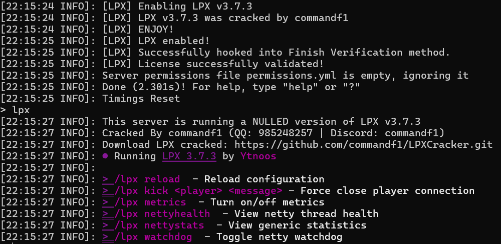

# LPXCracker
A non-backdoor LPX crack 
You can download the crack from release page.  
If you are worried about the possibility of getting infected by backdoor, you can download the latest version of LPX(which has verification) and put it in libs/LPX.jar and then build this project yourself.

# **How to Use**

1. download the crack from release page
2. put it in the 'plugins' dir
3. add a jvm arguments `--add-opens=java.base/java.lang=ALL-UNNAMED`
4. Run the server!